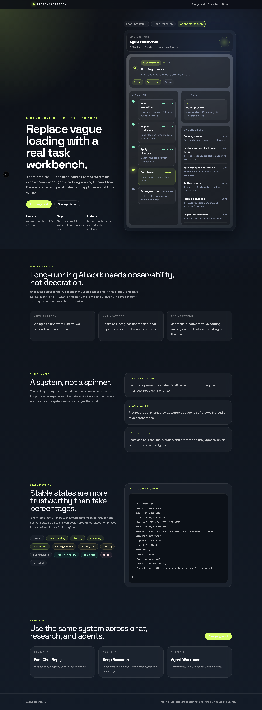
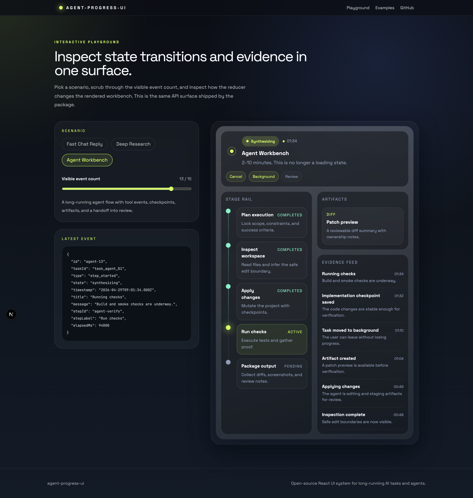
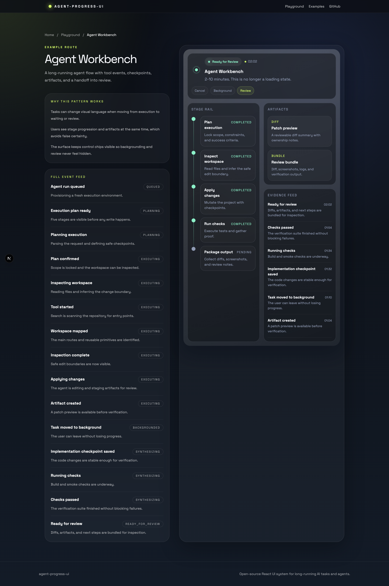
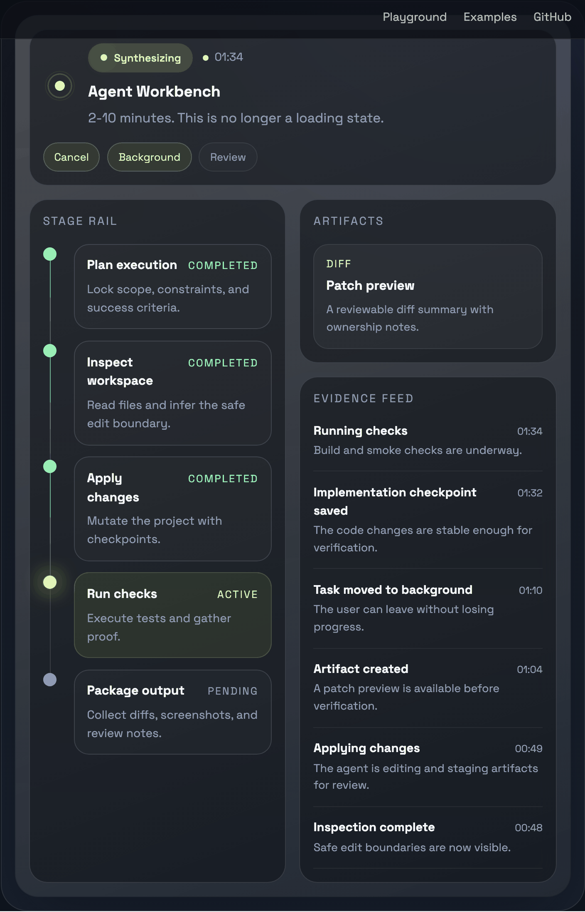

# agent-progress-ui

Open-source React UI system for long-running AI tasks and agents.

[](https://github.com/yongboGuo/agent-progress-ui/actions/workflows/ci.yml)
[](https://yongboGuo.github.io/agent-progress-ui/)
[](./LICENSE)


`agent-progress-ui` helps product teams replace vague loading states with observable, reviewable task workbenches. It ships a fixed state machine, reducer-driven snapshots, reusable React components, and a polished Next.js demo with chat, research, and agent examples.

Live demo: [yongboGuo.github.io/agent-progress-ui](https://yongboGuo.github.io/agent-progress-ui/)

## What ships in v0.1

- A stable task state machine for long-running AI work
- Reducer-driven `TaskSnapshot` generation from event streams
- Reusable React components: `TaskWorkbench`, `StageRail`, `EvidenceFeed`, `LivenessPulse`, `TaskStateBadge`, `TaskTimer`
- Three built-in scenario packs: chat, research, and agent
- A demo site with `/`, `/playground`, and `/examples/*`

## Quick start

```bash
npm install
npm run dev
```

Open `http://localhost:3000`.

## Repo layout

```text
apps/web        Next.js marketing site + interactive demo
packages/core   task states, event schema, reducer, scenario packs
packages/react  reusable React components for long-running task UIs
```

## Package shape

```ts
import { getTaskSnapshot, scenarioCatalog } from "@agent-progress-ui/core";
import { TaskWorkbench } from "@agent-progress-ui/react";

const snapshot = getTaskSnapshot(scenarioCatalog.agent.events);
```

## Docs

- [Principles](./docs/principles.md)
- [State machine](./docs/state-machine.md)
- [Event schema](./docs/event-schema.md)
- [Scenarios](./docs/scenarios.md)
- [中文 README](./README.zh-CN.md)

## Development

```bash
npm run lint
npm run typecheck
npm run test
npm run build
```

The repository ships with a CI workflow for validation and a GitHub Pages deployment workflow for the demo site.

## Assets






