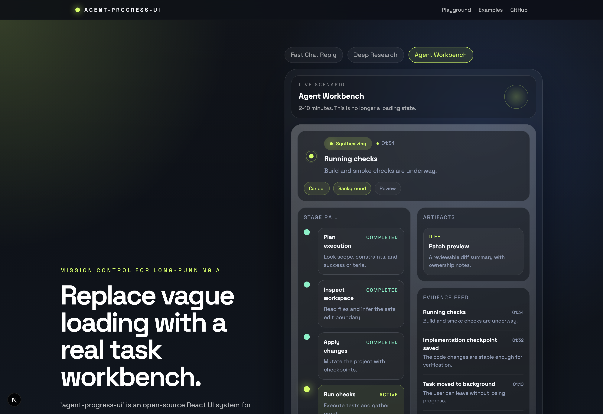

# agent-progress-ui

面向长运行 agent、MCP transcript、审批流和 artifact 的开源 React runtime UI kit。

[](https://github.com/yongboGuo/agent-progress-ui/actions/workflows/ci.yml)
[](https://yongboGuo.github.io/agent-progress-ui/)
[](./LICENSE)



`agent-progress-ui` 不再只是一个任务进度 demo。  
它现在定位为一个 **MCP-first 的 agent runtime UI kit**，适合 code agent、research agent 和带人工审批节点的长运行工作流。

在线 Demo: [yongboGuo.github.io/agent-progress-ui](https://yongboGuo.github.io/agent-progress-ui/)

## v0.2 包含内容

- 一套标准化的 `AgentRunEvent` / `AgentRunSnapshot` 模型
- 一个支持增量更新的 reducer 和 live store
- 一套可组合的 React 运行时工作台组件：
  `AgentWorkbench`、`AgentHeader`、`AgentStageRail`、`AgentTimeline`、`AgentEvidencePanel`、`AgentArtifactDock`、`AgentApprovalBar`、`AgentInspector`
- 一个薄适配层 `@agent-progress-ui/mcp`，用于把 transcript / session 信号映射到 runtime 模型
- 一个 reference app，直接展示 transcript slice、live store replay 和 MCP adapter demo

## 为什么仓库定位变了

这个仓库现在解决的是以下三者之间的空白：

- 只有 spinner、没有运行时上下文的 loading UI
- 只有消息列表、但 tool state 被藏起来的 chat shell
- 真正面向 operator 的 runtime workbench

新的核心原则很简单：**run 本身应该成为产品表面，而不是被藏在 loading 后面。**

## 快速开始

```bash
npm install
npm run dev
```

然后访问 `http://localhost:3000`。

## 最小示例

```ts
import { scenarioCatalog, getAgentRunSnapshot } from "@agent-progress-ui/core";
import { AgentWorkbench } from "@agent-progress-ui/react";

const snapshot = getAgentRunSnapshot(scenarioCatalog["code-agent"].events);
```

## MCP adapter 示例

```ts
import { createMcpRunAdapter, createMockMcpTranscript } from "@agent-progress-ui/mcp";

const adapter = createMcpRunAdapter({
  initialEnvelopes: createMockMcpTranscript("code-agent")
});

const snapshot = adapter.getSnapshot();
```

## 仓库结构

```text
apps/web        文档 + 交互式 reference app
packages/core   AgentRun 模型、reducer、store、mock 场景
packages/react  可组合 runtime workbench 组件
packages/mcp    薄 MCP transcript/session adapter
```

## 迁移说明

`v0.2` 是破坏性升级。

- `TaskEvent` -> `AgentRunEvent`
- `TaskSnapshot` -> `AgentRunSnapshot`
- `TaskWorkbench` -> `AgentWorkbench`
- 旧任务事件可通过 `legacyTaskEventsToAgentRunEvents` 转换

详细迁移说明见 [MIGRATION.md](./MIGRATION.md)。

## 开发

```bash
npm run lint
npm run typecheck
npm run test
npm run build
```

版本与发布准备：

```bash
npm run changeset
npm run version-packages
```
